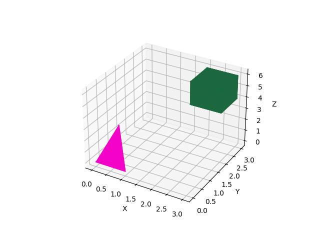

## Finalna dokumentacja projektu
## Oleksandr Konovalenko

### Temat projektu
Język umożliwiający opis punktów i odcinków w przestrzeni trójwymiarowej. Punkt i odcinek (zbudowany z punktów) są wbudowanymi typami języka. Z odcinków można budować bryły. Kolekcja brył tworzy scenę wyświetlaną na ekranie.

### Zakładana funkcjonalność i przykłady
#### Specyfikacja
- Język: Python
- Typowanie zmiennych: Statyczne, silne


#### Typy wbudowane
- **Typy proste**: `int`, `float`, `bool`, `string`
- **Typy złożone**:
  - `List`: Przechowuje obiekty, dostępne metody: 
    - `length()` : zwraca ilość elementów w liście
    - `get(x)`: zwraca element znajdujący się na pozycji x
    - `add(x)` : dodaje x-element na koniec listy
    - `remove(x)`: usuwa element znajdujący się na pozycji x, lub ostatni element jeśli x nie został podany
  - `Point`: Typ punktu z polami x, y, z oraz metodami do ich ustawiania (`set_x(x)`) i odczytu (`get_x()`).
  - `Line`: Definiowanie odcinka, dostępne metody: 
    - `set_start(start)` : ustawia punkt start
    - `set_end(end)`: ustawia punkt end
    - `get_start()`: zwraca punkt start
    - `get_end()`: zwraca punkt end
    - `length()` : długość odcinka
  - `Polyhedron`: Typ umożliwiający definiowanie bryły składającej się z dowolnej liczby odcinków, przy czym warunkiem koniecznym do jej stworzenia jest połączenie odcinków w jednolitą strukturę, gdzie każdy punkt bryły posiada co najmniej 3 różne wychodzące z niego odcinki. Typ ten oferuje następujące metody:
    - `points()` : zwraca listę punktów tworzących bryłę
    - `lines()`: zwraca listę odcinków wchodzących w skład bryły
  - `Collection`: Typ umożliwiający definiowanie zbioru brył, który może być wyświetlany na ekranie. Zawiera następujące metody:
    - `add(Polyhedron)` : dodaje bryłę do zbioru
    - `remove(Polyhedron)` : usuwa bryłę ze zbioru
    - `display()` : wyświetla trójwymiarowy rzut zbioru brył na ekranie
    - `empty()` : usuwa wszystkie bryły ze zbioru


#### Operatory
| Operator                          | Priorytet     | Asocjatywność  |
|-----------------------------------|---------------|----------------|
| ! (operator jednoargumentowy)     | 1 (Najwyższy) | Prawostronny   |
| * i / (mnożenie i dzielenie)      | 2             | Lewostronny    |
| + i - (dodawanie i odejmowanie)   | 3             | Lewostronny    |
| ==, !=, <, <=, >, >= (porównanie) | 4             | Lewostronny    |
| and (logiczne I)                  | 5             | Lewostronny    |
| or (logiczne LUB)                 | 6 (Najniższy) | Lewostronny    |


| Typ               | Operator                             | 
|-------------------|--------------------------------------|
| Arytmetyczne      | `+, -, *, /`                         |
| Logicze           | `==, !=, >, <, >=, <=` oraz `or, and`|
| Przypisania       | `=`                                  |
| Dostęp do obiektu | `.`                                  |
| Negacja           |`-, !`                                |

#### Dla poszczególnych typów dostępne są następujące operatory:

| Typ          | Operator                                 |
|--------------|------------------------------------------|
| int, float   | `=, +, -, *, /, ==, !=, >, <, >=, <=`    |
| bool         | `=, ==, !=, or, and, !`                  |
| string       | `=, +, ==, !=, *`                        |
| List         | `=, +, ==, !=, .`                        |
| Point, Line, Polyhedron, Collection | `=, ==, !=, .`    |


##### Arytmetyka
```
4 * 1 / 2 + 1 - 1      	# 2.0
4 * 3 / (2 + 1)       	# 4.0
10.8 / 3.2             	# 3.375
5.5 - 5 * ( -1)         # 10.5
```

##### String + inny typy
```
"1.05" + 1.05           # "1.051.05"
"1.05a" + 1             # "1.05a1"
2 + 1.5 + "gf"          # "3.5gf"
1.5 + 2                 # 3.5
4 + True                # 5
```

##### Porównanie
```
1 == 1                  # True
1 != 2                  # True
1 < 2                   # True
2 > 1                   # True
1 <= 1	                # True
1 >= 2                  # False
(1 == 1) or (1 == 2)    # True
(1 == 1) and (2 == 2)   # True
!(1 == 1)               # False
1 == True               # True
"text" == "text"        # True
"hello" != "world"      # True
```

#### 1. Przykład definicji zmiennych i operacji arytmetycznych:
```
int x;                  # Deklarowanie zmiennej x
x = 10;                 # Ustawinie x na 10
int y = 5;              # Deklaracja zmiennej y i przypisanie jej wartości 5
int z = (x + y) * 2;    # Deklaracja zmiennej z i obliczenie jej wartości
```

#### 2. Przykład operacji na ciągach znaków:
```
string hello = "Hello, "
string world = "World!"
print("hello" + "world")     # Łączenie ciągów znaków i drukowanie wyniku
print("hello" * 2)
```

#### 3. Przykład komentarza:
Komentarze tworzymy dodając `#` na początku linii.
```
# To jest komentarz
```

#### 4. Przykład instrukcji warunkowej if:
```
if (a > 3 or value != b)
{
    print(value);
}
else
{
    a = a + 1;
}
```

#### 5. Przykład pętli while:
```
while(liczba >= 17):
{
    liczba = a * liczba
}
```

#### 6. Przykład definicji i wywołania funkcji:
```
int fun1(int a, int b)
{
    return a + b;
}

int a = 2;
int b = 3;
int c;

c = add(a, b);
```

#### 7. Przykład rekursywnego wywołania funkcji
```
int fun1(int x)
{
    if(x == 5)
    {
        return 0;
    }
    else
    {
        x = x - 1;
        print(x);
        fun1(x);
    }
}

int a = 8
fun1(a)
```


#### 8. Logical and
```
true and false  # false
true and true   # true
```

#### 9. Logical or
```
true or false  # true
true or true   # true
```


#### Typizacja:
```
int a = 2;              # a jest teraz liczbą całkowitą (int)
a = 2.3;                # próba przypisania float

Error: Type mismatch: Type mismatch in line 1, column 27: 
a is not a valid type

```

#### Zakresy widoczności zmiennych:
```


int test(int t) {
    int a = 3;
    print(a);           # 3
    t = t + 1;
    return t;           # 2
}

int main() {
    int a = 4;
    int t = 1;
    test(t);             #3, 2
    print(a);            # 4
    print(t);            # 1
}

```
#### Definiowanie funkcji
Wszystkie programy muszą zawierać funkcję `int main()`, która jest punktem startowym wykonania. Funkcje można definiować z typem zwracanej wartości, np.:

```
int suma(a, b) {
    return a + b;
}
```

#### Przykładowy kod programu

```
int main()
{
    Point a = Point(0, 0, 0);
    Point b = Point(1, 0, 0);
    Point c = Point(0, 1, 0);
    Point d = Point(0.5, 0.5, 3);
    Line ab = Line(a, b);
    Line ac = Line(a, c);
    Line ad = Line(a, d);
    Line bc = Line(b, c);
    Line bd = Line(b, d);
    Line cd = Line(c, d);
    Polyhedron p = Polyhedron(ab, ac, ad, bc, bd, cd);

    Point x = Point(2, 2, 4);
    Point y = Point(3, 2, 4);
    Point z = Point(2, 3, 4);
    Point w = Point(3, 3, 4);
    Point u = Point(2, 2, 6);
    Point v = Point(3, 2, 6);
    Point i = Point(2, 3, 6);
    Point j = Point(3, 3, 6);
    Line xy = Line(x, y);
    Line xz = Line(x, z);
    Line wy = Line(w, y);
    Line wz = Line(w, z);
    Line xu = Line(x, u);
    Line yv = Line(y, v);
    Line zi = Line(z, i);
    Line wj = Line(w, j);
    Line uv = Line(u, v);
    Line ui = Line(u, i);
    Line jv = Line(j, v);
    Line ji = Line(j, i);
    Polyhedron s = Polyhedron(xy, xz, wy, wz, xu, yv, zi, wj, uv, ui, jv, ji);

    Collection scene = Collection(s);
    scene.add(p);
    scene.add(s);
    scene.display();

    scene.empty();
    scene.display();

    return 0;
}

```
#### Przykładowe wyświetlenie sceny
Scena wyświetlana na ekranie zawiera wielościany zbudowane z odcinków i punktów, układających się w bryły 3D, przedstawione w rzucie trójwymiarowym.


#### Funkcje wbudowane
- print - wypisuje linię na wyjście standardowe.

#### Podział na moduły
Projekt podzielono na moduły odpowiadające za analizę leksykalną, składniową i interpretację kodu:

- **Lekser** - Moduł realizujący analizę leksykalną, który składa się z plików `source.py`, `lexer.py` oraz testów zawartych w `test_lexer.py`:
  - `source.py` - Moduł odpowiedzialny za wczytywanie kodu z pliku tekstowego lub ciągu znaków przekazanego w argumencie wywołania,
  - `lexer.py` - Moduł przeprowadzający analizę leksykalną, tworzący listę tokenów gotowych do analizy składniowej,

- **Parser** - Moduł realizujący analizę składniową, obejmujący pliki `nodes.py`, `parser.py` oraz testy w `test_parser.py`:
  - `nodes.py` - Moduł zawierający klasy reprezentujące węzły drzewa składniowego,
  - `parser.py` - Moduł odpowiedzialny za analizę składniową, tworzący drzewo składniowe gotowe do interpretacji,

- **Interpreter** - Moduł realizujący interpretację kodu, składający się z plików `classes.py`, `context.py`, `visitor.py`, `interpreter.py` oraz testów zawartych w `test_interpreter.py`:
  - `classes.py` - Moduł definiujący klasy reprezentujące typy danych złożonych, które są używane podczas interpretacji,
  - `context.py` - Moduł zawierający klasę reprezentującą kontekst interpretacji, przechowującą zmienne i funkcje,
  - `visitor.py` - Moduł implementujący klasę wizytatora drzewa składniowego, która przekształca drzewo składniowe na drzewo interpretacji,
  - `interpreter.py` - Moduł wykonujący interpretację kodu, zwracający wynik jego wykonania,

Interakcje między modułami:

Lexer przetwarza źródło i generuje sekwencję tokenów.\
Parser analizuje tokeny, tworzy drzewo składniowe i generuje instrukcje, które są wykonywane przez Interpreter.

Dodatkowo, w pliku `errors.py` znajdują się klasy reprezentujące błędy, które mogą wystąpić podczas analizy leksykalnej, składniowej i interpretacji, a plik `main.py` zawiera funkcję `main`, odpowiedzialną za uruchomienie programu.

#### Biblioteki
Do wizualizacji brył używane są:
- `numpy` - do obliczeń,
- `matplotlib` i `scipy` - do renderowania brył na ekranie.

Dodatkowe wymagane biblioteki są w pliku `requirements.txt`.

#### Poprawiona gramatyka języka:
Gramatyka języka określa zasady składni, które interpreter sprawdza i przetwarza podczas interpretacji kodu.

```
program                 = {function_declaration} ;

block                   = "{", {statement}, "}" ;

statement               = assignment | if_statement | while_statement | function_call, ";" | method_call, ";" | return, ";" ;

assignment              = (type, identifier | identifier), "=", expression, ";" ;

if_statement            = "if", "(", expression, ")", block, ["else", block] ;

while_statement         = "while", "(", expression, ")", block ;

function_call           = identifier, "(", [call_parameters_list], ")" ;

method_call             = identifier, ".", function_call ;

call_parameters_list    = expression, {",", expression} ;

function_declaration    = function_type, identifier, "(", [parameters_list], ")", block ;

parameters_list         = type, identifier, {",", type, identifier} ;

return                  = "return", [expression] ;

expression              = or_expression ;

or_expression           = and_expression, {or_operator, and_expression} ;

and_expression          = comparison_expression, {and_operator, comparison_expression} ;

comparison_expression   = arithmetic_expression, [comparison_operator, arithmetic_expression] ;

arithmetic_expression   = multiplicative_expression, {arithmetic_operator, multiplicative_expression} ;

multiplicative_expression = negation_expression, {multiplicative_operator, negation_expression} ;

negation_expression     = [negation_operator], factor ;

factor                  = meth_func_ident | "(", expression, ")" | literal

meth_func_ident         = ident_or_call, {'.', ident_or_call};

ident_or_call           = identifier, ["(", [call_parameters_list], ")"];
 
arithmetic_operator     = "+" | "-" ;

multiplicative_operator = "*" | "/" ;

comparison_operator     = "==" | "!=" | ">" | "<" | ">=" | "<=" ;

or_operator             = "or" ;

and_operator            = "and" ;

negation_operator       = "-" | "!" ;

function_type           = "void" | type ;

type                    = "int" | "float" | "bool" | "string" | "Point" | "Line" | "Collection" | "List" ;

identifier              = letter, {letter | digit} ;

literal                 = int | float | bool | string ;

int                     = "0" | (non_zero_digit, {digit}) ;

float                   = int, ".", digit, {digit} ;

bool                    = "True" | "False" ;

string                  = '"', {char}, '"' ;

char                    = ({letter} | {digit} | {symbol}) ;

letter                  = #'[a-z]' | #'[A-Z]' ;

digit                   = "0" | "1" | ... | "9" ;

symbol                  = " " | "." | "," | "!" | "?" | ":" | "/" | "@" | "$" | "%" | "^" | "*" | "-" | "+" | "_";
```

### Obsługa błędów
Program generuje komunikaty w przypadku błędów krytycznych, przerywając działanie programu.

Przykładowe komunikaty:
```
Error: Invalid token encountered: Error occured in line 1, column 21: 
Invalid character '@'
```
```
Error: Invalid Syntax: Error occured in line 1, column 12: 
Invalid syntax: Tried to build function block but got None
```

```
Error: Undeclared variable: Variable undeclared in line 1, column 24: 
Variable 'c' is not declared
```

### Sposób uruchomienia


Może być uruchamiany z wiersza poleceń, gdzie użytkownik podaje plik źródłowy (z rozszerzeniem .txt) jako argument.

Po wykonaniu interpretera, można oczekiwać wyjście na konsoli.
```
python .\main.py -f tests/test_cases/figures.txt
python .\main.py -t (kod)
```

#### Analiza wymagań
- Program interpretuje kod z pliku tekstowego lub ciągu znaków przekazanego jako argument wywołania,
- Program wyświetla wynik działania na konsoli,
- Sprawdza poprawność leksykalną i składniową kodu, zgłaszając wykryte błędy,
- Zapewnia unikalność nazw zmiennych i funkcji,
- Weryfikuje poprawność tworzenia zmiennych typów złożonych,
- Umożliwia wielokrotne tworzenie i wyświetlanie scen zawierających bryły.


### Sposób testowania
Testowanie projektu polega na przygotowaniu testów jednostkowych, które sprawdzają poprawność analizy leksykalnej, składniowej i semantycznej. Przykłady testów obejmują:

Sprawdzanie poprawności analizy leksykalnej, czy tokeny są generowane prawidłowo.\
Analizę składniową, czy parser prawidłowo interpretuje strukturę kodu.\
Wykonywanie testów na różnych przykładach z różnymi operacjami matematycznymi, logicznymi i operacjami na ciągach znaków.
Obsługę błędów, takie jak próby użycia niezadeklarowanych zmiennych lub funkcji.


#### Testy folder

Testy jednostkowe znajdują się w folderze "tests". Każdy moduł ma przygotowane testy jednostkowe za pomocą `pytest`.\
Mamy testy działania interpretera, parsera i lexera.\
W interpreterze testują  różne aspekty tym deklaracje zmiennych, definicje i wywołania funkcji, instrukcje warunkowe, pętle, operacje arytmetyczne i logiczne\
oraz funkcje wbudowane. Testy obejmują przypadki poprawne, jak i błędne